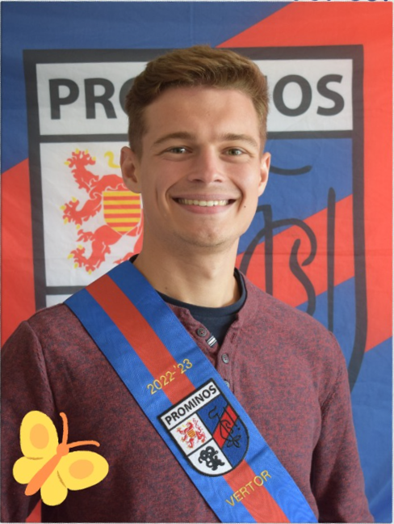

## Verplichte activiteiten

### persoonlijke ontwikkeling

<h4>Projectweek</h4>
<ul style="margin-top:0">
<li>Tijdens de projectweek hebben we ons voornamelijk bezig gehouden met seminaries en POPsessies. De start van het researchproject vond plaats op vrijdag.</li>
<li>Hogeschool PXL (verschillende localen over meerdere blokken)</li>
<li>13/02/2023 - 17/02/2023</li>
</ul>

<h4>POPsessie: POPping</h4>
<ul style="margin-top:0">
<li>Tijdens deze POPsessie hebben we het gehad over persoonlijke sterktes en zwaktes en welke invloed deze zouden hebben tijdens het researchproject.</li>
<li>Hogeschool PXL - B301</li>
<li>28/02/2023, 8:30 - 10:30</li>
</ul>

<h4>POPsessie: Brein aan het werk! Niet storen!</h4>
<ul style="margin-top:0">
<li>We bekeken de effecten van digitalisering op onze hersenen en zochten naar tools om ons werk zo efficiënt mogelijk aan te pakken.</li>
<li>Hogeschool PXL - B301</li>
<li>28/02/2023, 10:30 - 12:30</li>
</ul>

<h4>POPsessie: My Team and I</h4>
<ul style="margin-top:0">
<li>POPsessie over hoe men het best kan functioneren en groeien in een team. Eerst een kleine briefing en wat uitleg, daarna heel wat teambuilding.</li>
<li>Corda Campus: gebouw 7</li>
<li>18/10/2023, 13:30 - 15:30</li>
</ul>

### Seminarie

<h4>Refleqt: Security</h4>
<ul style="margin-top:0">
<li>Refleqt, een Quality Assurance bedrijf, is kort en bondig het belang van security komen uitleggen met een kleine introductie tot implementatie.</li>
<li>Digital PXL - G412a</li>
</ul>

<h4>Politie: Forensics</h4>
<ul style="margin-top:0">
<li>De politie is een introductie komen geven met forensics als thema. Er werd uitleg gegeven over hoe verwijderde data gerecupereerd kon worden van disks en RAM.</li>
<li>Digital PXL - G414</li>
<li>02/05/2023, 10:00 - 12:00</li>
</ul>

<h4>Inuits: Nomad</h4>
<ul style="margin-top:0">
<li>Een gepassioneerd medewerker van Inuits heeft ons kennis laten maken met Nomad, een container orchestrator. Achteraf volgende een klein stukje praktijk.</li>
</ul>

<h4>Ericsson: 5G</h4>
<ul style="margin-top:0">
<li>Een algemene uitleg van Ericsson over 5G, de overstap van 4G naar 5G en de toekomst.</li>
<li>Digital PXL - G414</li>
<li>16/05/2023, 09:00 - 11:00</li>
</ul>

<h4>Datasense: Battle of the Cloud platforms</h4>
<ul style="margin-top:0">
<li>Een algemene introductie van verschillende Cloudplatforms. Functionaliteit, architectuur en de grote verschillen kwamen voornamelijk aan bod.</li>
<li>Digital PXL - B124</li>
<li>22/11/2023, 13:30 - 17:30</li>
</ul>

<h4>ACA group: OWASP Top Ten risico's</h4>
<ul style="margin-top:0">
<li>Een korte introductie, en daarna een praktische les over de OWASP Top Ten met behulp van de OWASP Juice Shop.</li>
</ul>

<h4>Secwise: Cyber security operations in the real world</h4>
<ul style="margin-top:0">
<li>Een seminarie over real-world cybersecurity operations met een bestaande use case als voorbeeld hoe te handelen bij een security incident.</li>
<li>Digital PXL - B124</li>
<li>06/12/2023, 13:30 - 17:30</li>
</ul>

<h4>TheValueChain: SAP: AI en process automation</h4>
<ul style="margin-top:0">
<li>De inhoud van SAP, hoe bedrijven hiermee aan de slag gaan en ook wat voor invloed SAP heeft op het dagelijkse leven.</li>
<li>Digital PXL - B123</li>
<li>13/12/2023, 13:30 - 17:30</li>
</ul>

### innovatie

<h4>Innovatieroute Cloud & Security</h4>
<ul style="margin-top:0">
<li>Verschillende seminaries behandelden meerdere topics binnen Cloud & Security. Firewalls, penetration testing en DevSecOps kwamen hier aan bod.</li>
<li>Digital PXL - lokaal G412b</li>
<li>28/09/2023 - 19/10/2023</li>
</ul>

## Extra activiteiten

### student engagement

  <h4>Studentenvereniging Prominos: Vertor</h4>
  <ul style="margin-top:0">
    <li>Gedurende een jaar lang heb ik de functie van Vertor (mediaverantwoordelijke en fotograaf) mogen bekleden bij Prominos van departement Education.</li>
    <li>Education PXL – Gebouw F verdieping 8 (verenigingslokaal)</li>
    <li>19/09/2022 – 17/09/2022</li>
    <li>Bewijsstukken
      <ul>
        <li>Praesidiumfoto</li>
        <li>Één van mijn banners voor een lezing.</li>
      </ul>
    </li>
  </ul>
  

    
    
  

    • Student Engagement
        ◦ Studentenvereniging Prominos: Schachtenmeester
        ◦ Gedurende een jaar lang heb ik de functie van Schachtenmeester (aanspreekpunt voor nieuwe leden) mogen bekleden bij Prominos van departement Education.
        ◦ Education PXL – Gebouw F verdieping 8 (verenigingslokaal)
        ◦ 18/09/2023 – 15/09/2024
        ◦ Bewijsstukken
            ▪ Praesidiumfoto
