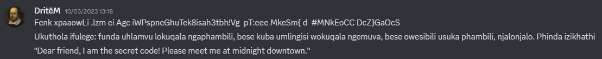

## Activiteit 1: Cyber Security Challenge Belgium

Zowel in 2023 als 2024 heb ik aan de Cyber Security Challenge Belgium meegedaan. Dit is een online wedstrijd waar je zoveel mogelijk uitdagingen moet oplossen in een tijdspanne van 48 uur. Deze puzzels omvatten thema’s zoals cryptografie, reverse engineering, netwerkbeveiliging, forensisch onderzoek en nog veel meer.

De complexiteit van de puzzels verschilde enorm, wat ieder persoon de mogelijkheid gaf om tenminste enkele rooms op te lossen. Zo waren er puzzels waar je slechts een simpele codering moest achterhalen, of waar je braille moest vertalen. Als je de opgave begreep, wist je dat je waarschijnlijk vrij ver kon raken in de opgave. Zoals je kan zien in de onderstaande foto, was dit één van de makkelijkere oplossingen. Het brailleschrift moest gewoon vertaald worden. Aan de andere kant van het spectrum waren er rooms waar je enorm veel werk in moest steken. Zo was er in 2023 een room die je enkel kon maken indien de webpagina werd geopend in Windows XP met Internet Explorer 2004 (of indien dit gesimuleerd werd).

In 2023 hebben we het redelijk goed gedaan ondanks dat we er blind zijn ingegaan. We waren toch in de eerste helft van alle teams geraakt, wat geen slechte prestatie is voor studenten die voor de rest niet heel verdiept waren in security.

Één van mijn favoriete challenges was de ‘ChallengeCeption’. In deze puzzel zaten vier flags verstopt en per gevonden flag kreeg je meer punten. Ik heb hier redelijk wat tijd ingestoken, en uiteindelijk heb ik er drie uitgehaald. De eerste twee flags waren redelijk makkelijk om te vinden, maar de andere twee niet dus het was wel fijn om op zijn minst één van de twee moeilijkere te vinden. Om deze oplossingen te vinden hebben ik gebruik gemaakt van het programma WireShark. De eerste kon gevonden worden met een simpel commando:

De tweede flag kon gevonden worden door een gecodeerde tekst te ontcijferen, en hier verder op te bouwen. De valkuil bij deze opdracht was echter dat er helemaal geen codering was, de tekst was namelijk geschreven in Zulu. Dit gaf ons de instructies om de flag te ontcijferen, en zo hebben we deze gevonden aan de hand van een simpel script.

De derde oplossing kon gevonden worden door een wachtwoord te halen uit een webpagina. Dit wachtwoord kon dan gebruikt worden om een pdf te openen dat een vreemde inhoud had:

Dit was echter gewoon tekst waarvan het lettertype niet correct was inbregrepen in het document. Als je dit kopiëerde naar een tekstverwerker, bekwam je de flag:

Ook dit jaar hebben we meegedaan aan de Challenge. In 2023 hadden we meer flags gevonden, maar ook deze keer hebben we het niet slecht gedaan.

De opdracht die mij het meest is bijgebleven was de ‘Glutton’  challenge. Er stond dat het een makkelijke opgave was, echter waren er weinig teams die deze opgelost kregen. Bij deze opdracht kreeg je een binary-file die je moest omzetten naar een hexadecimale waarde. Bij het ingeven van deze waarde in het programma CyberChef, kon je de oplossing bekomen. De oplossing was namelijk gecodeerd met een XOR cipher, die je kan kraken met cyberchef.

Ik heb me tweemaal geamuseerd met de Cyber Security Challenge. Het waren opdrachten die ik vrijwillig heb gedaan, en ik heb nooit het gevoel gehad alsof het een verplichting was. Het was oprecht iets fijns waar ik mee bezig was. Zeker de eerste hackaton in 2023 heeft een goede nasmaak achter gelaten, aangezien dit de eerste keer was dat ik iets van dit caliber ondernomen heb.

Het was mogelijk om alleen mee te doen aan deze hackaton, maar ik ben blij dat ik dit tweemaal een toffe groep had. Indien er iemand vastzat bij een vraag, wat vaak genoeg gebeurde, konden we elkaar te hulp schieten en zo samen de uitdaging oplossen. Veel van deze challenges verplichtten je om out of the box te denken, wat ook een stuk makkelijker was in groep, aangezien niet iedereen dezelfde sterktes en zwaktes heeft. Zo kon ik vaak mijn steentje bijdragen bij forensische vragen en uitdagingen rond encryptie, maar was ik een mindere bijdrage bij vraagstukken rond reverse engineering en programmeren.

Uiteindelijk ben ik blij dat ik tweemaal heb meegedaan aan deze hackaton, aangezien cybersecurity een onderwerp is dat niet alleen belangrijk is, maar wat me ook interreseert. Dat is ook de reden waarom ik heb gekozen om dit op te nemen in mijn portfolio. Het is een waardevolle bijdrage geweest op allerlei vlakken zoals teamwork, kennis van cybersecurity, en out of the box denken. Het heeft ook nooit aangevoeld alsof ik met iets bezig was voor school tijdens de hackaton, maar eerder met iets wat me oprecht interesseert.

## Activiteit 2: Praesidium Prominos

Ik heb twee jaar lang in het praesidium, ofwel het bestuur, van Prominos, de studentenvereniging van PXL Education mogen zitten. In mijn eerste jaar bekleedde ik de functie vertor.  In het kort betekent dit dat ik verantwoordelijk was voor het mediateam en de inkleding van onze evenementen, en dat ik  de fotograaf en grafisch ontwerper van dienst was. Het tweede jaar was ik de Schachtenmeester, wat betekent dat ik verantwoordelijk was voor de nieuwe leden van de vereniging.

Het bestuur van een studentenvereniging wordt het praesidium genoemd. Dit bestuur wordt ieder academiejaar verkozen om een jaar lang de vereniging te leiden, onder visie van de praeses, ofwel de voorzitter. Ieder persoon in het praesidium is verantwoordelijk voor een bepaalde functie.

In het academiejaar 22’ – 23’ was ik de vertor. Deze functie is echter iets specialer omdat er meerdere verantwoordelijkheden bij komen kijken. Als je het heel algemeen zou moeten beschrijven, dan staat de vertor in voor evenementen. Door de jaren heen kwam er steeds meer kijken bij iets simpel als ‘een evenement’ waardoor er nieuwe functies zijn gecreëerd om de last op de vertor wat te verminderen. Dit heeft als gevolg dat de taken die overschieten voor de vertor op het eerste zicht niet direct iets met elkaar te maken hebben, maar er zit een logisch verband in als je de geschiedenis kent. Hierdoor was ik grafisch ontwerper, fotograaf en verantwoordelijk voor de inkleding van evenementen.

Dit jaar ben ik de Schachtenmeester binnen Prominos. De term ‘schacht’ wordt gebruikt voor nieuwe leden van de vereniging, en de schachtenmeester is dus de verantwoordelijke voor deze nieuwe leden.  Dit klinkt redelijk simpel, maar dit is een zeer belangrijke taak, aangezien je eigenlijk de eerste persoon bent die ieder jaar de toekomst van de vereniging moet verzekeren. De Schachtenmeester is zowel het eerste aanspreekpunt, als een mentor voor de schachten. Indien er nieuwe leden met vragen zaten, was ik meestal de persoon die hen verder hielp. Het is ook mijn verantwoordelijkheid om hen alle kneepjes van het studentenleven te leren. Verder ben je ook een rolmodel voor de schachten, net omdat je dat eerste aanspreekpunt bent. Het was belangrijk dat ik altijd professioneel en zo onpartijdig mogelijk bleef.

Enkele leuke dingen die ik heb georganiseerd voor onze nieuwe leden zijn blokbars, uitjes naar de kermis en in april zelfs een weekend. Natuurlijk heb ik dit niet allemaal zelf gedaan. Het gehele praesidium werkt hier aan mee, maar je draagt wel de eindverantwoordelijkheid om de nieuwe leden hierin te betrekken en om hen welkom te laten voelen in de vereniging.

Losstaand van de functies, moet je ook samenwerken met de andere bestuursleden. Het is belangrijk dat alles goed verloopt en dat het nergens in de soep draait. Iedereen heeft zijn eigen functie, maar uiteindelijk helpt iedereen elkaar waar nodig indien het ergens vastloopt. Er worden maandelijks twee vergaderingen georganiseerd, één interne die enkel voor het praesidium bestemd is, en één externe waar vaste leden ook welkom zijn. Praesidiumleden hebben een verplichting om hier aanwezig te zijn, tenzij je een goed reden hebt om dat niet te zijn.

Mijn twee jaren in het bestuur van Prominos waren een onvergetelijke tijd. Het heeft me doen groeien als persoon en ik heb hier vriendschappen gemaakt die niet snel zullen vergaan. Ik kan terugkijken naar mezelf toen ik pas ben gestart in het bestuur en een héél duidelijk verschil zien met hoe ik nu ben. Oorspronkelijk moest ik vaak navragen of ik wel correct bezig was aan andere leden met meer ervaring. Vaak was het allemaal wel in orde, maar de momenten dat het niet zo was, dan kreeg ik duidelijke feedback over hoe ik kon verbeteren. Ik bevind me nu in de situatie dat andere leden, zowel schachten, als andere praesidiumleden naar mij toe komen om advies. Het is fijn om te beseffen dat ik nu dat lid ben met meer ervaring die anderen kan verder helpen waar nodig. Echter moet ik ook nog steeds advies vragen indien ik iets niet weet. Schachtenmeester is een belangrijke functie die tot in de puntjes goed uitgevoerd moet worden, dus ik vraag nog regelmatig aan ex-Schachtenmeesters of ik correct bezig ben.

Er zijn oneindig veel dingen die ik zou kunnen vertellen over de dingen die ik geleerd heb bij Prominos, maar het belangrijkste dat ik geleerd heb is, feedback aannemen en ook feedback geven. Ik heb hier meermaals om gevraagd bij mijn andere bestuurs- en Prominosleden. Dit heeft me enorm geholpen om mijn functie consistent goed uit te voeren.

Ik heb getwijfeld om dit op te nemen in mijn portfolio omdat studentenverenigingen en clubs tegenwoordig niet in het beste daglicht staan, maar ik doe het toch, aangezien deze twee dingen echt een enorme invloed hebben gehad op mijn groei als persoon, en het bereiken van de X-factor.

## Activiteit 3: Praesidium Saltator Orator Sodalis

Naast mijn studentenvereniging, ben ik ook al enkele jaren trots lid van mijn studentenclub: Saltator Orator Sodalis, ofwel SOS. In 2020 hebben ze  mij gevraagd om me hier bij aan te sluiten, en de rest is geschiedenis.

Net zoals bij een vereniging, werkt een studentenclub ook met functies. In mijn eerste praesidiumjaar was Ik Quaestor, ofwel de penningmeester. Ik beheerde gedurende anderhalf jaar de kassa van onze club. Het is een functie met veel verantwoordelijk, aangezien een belangrijk deel van de club in mijn handen lag. Buiten de quaestor is er niemand anders om op terug te vallen als het aankomt op de kassa, dus het was belangrijk dat ik mijn taak correct deed.

Er komt veel kijken bij het werk van een Quaestor. Zo beheerde ik het kasboek, de kassa zelf, de inkopen en uitgaven van de club, en de winst (of het verlies) tijdens evenementen. Elke maand maakte ik een klein verslag van alle transacties, en bewaarde ik dit in het kasboek. Dit boek werd hierna zelf ook bijgewerkt, zodat we altijd up-to-date bleven met onze uitgaven.

Indien er een evenement aanstaande was, ging ik vaak inkopen doen in naam van de club, aangezien dit voor mij het makkelijkste te beheren was. Indien dit niet ging, en iemand anders moest rijden, moest er goed gecommuniceerd worden wat ons budget was en wat we exact nodig hadden. Op evenementen zelf zat ik zo goed als altijd achter de kassa, zodat ik belangrijke zaken kon bijhouden zoals: hoeveel mensen er zijn binnengekomen, hoeveel bonnetjes verkocht zijn, en welke drank er verkocht werd. Dit laatste was belangrijk om na te rekenen hoeveel wij uiteindelijk moesten betalen voor de verkochte drank aan de eigenaar van de zaal.

Momenteel ben ik bezig met mijn twee praesidiumjaar binnen mijn studentenclub, en ditmaal ben ik de Ab Actis, ofwel secretaris en de mediaverantwoordelijke. De Ab Actis schrijft verslagen tijdens vergaderingen en verzorgt de interne communicatie binnen de club. Het is belangrijk dat andere leden van de club, weten wat de stand van zake is binnen de club. Om deze redenen post ik na de maandelijkse vergadering een verslag zodat de andere clubleden terug geïnformeerd zijn. Dit geeft hen ook het gevoel dat ze nog actief betrokken worden in de club.

Mediaverantwoordelijke is een rol die ik officieus gekregen heb. Doordat ik al veel van de interne communicatie deed, was het makkelijker om me ook bezig te houden met evenementen te promoten op social media. Momenteel maak ik de banners voor onze interne en externe evenementen die op facebook terecht komen, en promoot ik ze binnen de club om de oude leden betrokken te houden.

Ook in een club is een goede samenwerking belangrijk. Ik zou zelfs durven zeggen dat dat van een groter belang is dan bij een vereniging, omdat een studentenclub in het algemeen een kleiner praesidium heeft. Momenteel zijn we met zijn vieren, dus is het cruciaal dat we een goede band hebben, wat gelukkig ook zo is. Indien er iemand zou wegvallen, wordt het plots een stuk moeilijker om alles geregeld te krijgen. Veel communicatie en teambuilding is de juiste boodschap.

Net zoals bij mijn vereniging, heb ik ook bij mijn club een enorme groei gekend. Mijn eerste functie binnen een praesidium was ook bij SOS, dus dit is mijn eerste blootstelling geweest aan het bestuur binnen het studentenleven.

Eén van de belangrijkste eigenschappen die enorm verbeterd is dankzij SOS is mijn communicatie. Toen ik pas begon als praesidiumlid, ging niet alles even vlot. Veel zaken werden niet, of te laat in orde gebracht en dit kwam vaak door een tekort aan communicatie binnen ons praesidium. Wij zijn toen redelijk snel op ons vingers getikt, want het moest een stuk beter. Natuurlijk veranderde dit niet van het ene moment op het andere, maar gradueel ben ik wel beter geworden in efficiënt communiceren.

Vragen durven stellen is waarschijnlijk mijn beste eigenschappen die ik mezelf aangeleerd heb tijdens mijn tijd als Quaestor bij SOS. Het werpt ook zijn vruchten af, want ik merk dat ik een betere werker geworden, zowel in beide praesidia, als ook op mijn stageplaats. Indien ik ergens vastloop, probeer ik het eerst zelf op te lossen, maar als ik merk dat ik niet verder raak, dan vraag ik op tijd om hulp aan mijn collega’s bij Inuits.

Het lijkt misschien vanzelfsprekend, maar ik ben ook een stuk socialer en vlot in omgang geworden door mijn club. Het is niet dat ik moeite had om sociale contacten te leggen, maar ik heb wel geleerd om grenzen te verleggen en nieuwe uitdagingen aan te gaan met mensen die ik oorspronkelijk niet kende. Ik merk nu dat het ook makkelijk voor mij is om op kennis te maken met een hele groep collega’s waar ik nog een tijdje mee zal werken.

## Activiteit 4: Praesidium Saltator Orator Sodalis

Het weekend van 2 maart 2024 ben ik op reis geweest met Inuits,  het bedrijf waar ik mijn stage uitvoer. We hebben een reis gemaakt naar Tsjechië, waar Inuits een bureau heeft en dus ook meerdere werknemers.

Nog maar één week in mijn stage werd er mij verteld dat Inuits een trip zou maken naar Tsjechië, en dat de stagiairs ook mee mochten indien we dit wilden. Ik heb geen moment getwijfeld om dit te accepteren.

Op vrijdag 2 maart zijn we in de vroege uurtjes vertrokken naar Eindhoven, waar wij onze vlucht hadden naar Praag. In Eindhoven heb ik persoonlijk kennis gemaakt met de andere twee stagiairs van Inuits. Zij voeren hun stage uit in Gent. Tot nu had ik hen enkel gesproken tijdens online meetings, dus het was fijn om ze in het echt te ontmoeten. Eenmaal aangekomen in Tsjechië, moesten we nog een halfuurtje de bus op om naar het centrum van Praag te rijden. Toen we er uiteindelijk waren, kon het weekend officieel van start gaan.

We zijn de dag begonnen met een gegidste fietstocht door de stad. In snel tempo maakten we kennis met Praag en haar geschiedenis. Fietsen door Praag was echter alles behalve evident, aangezien de gemiddelde inwoner van Praag weinig tot geen rekening houden met fietsers. Dat gecombineerd met een heuvellandschap en kasseien als wegdek zorgde voor een unieke ervaring. We eindigden de rit in een brasserie waar we ons middagmaal konden nuttigen. Dit was het ideale moment om bij te praten en kennis te maken met heel wat collega’s aangezien zo goed als heel het bedrijf op deze reis aanwezig was. Na enkele uurtjes konden we verder met de reis, ditmaal naar de andere kant van het land. We gingen de bus terug om naar Brno te gaan, de stad waar het bureau van Inuits lag.

De tweede dag zijn we begonnen met een wandeling naar het bureau van Inuits. Na een korte kennismaking met de Tsjechische collega’s en een speech van de CEO, hebben we de dag verder gezet met een stadsspel. Iemand van de collega’s in Brno had dit voorbereid zodat wij de stad interactief konden leren kennen. Net zoals Praag, is Brno alles behalve een vlakke stad. Na heel wat kilometers in de benen, keerden we terug naar het hotel. In de eetruimte van het hotel werd er opnieuw een speech gegeven met de toekomst van Inuits als inhoud. Dit was een speciaal moment omdat ik plots vermeld werd voor heel het bedrijf. Mijn stageopdracht behandelt namelijk een topic waar Inuits in wilt investeren, dus kreeg ik een kleine shout-out.

De laatste dag zijn we teruggekeerd naar Praag. We hadden redelijk wat vrije tijd, dus zijn de andere stagiairs en ik de stad wat op ons eigen gaan verkennen. We hadden met zijn allen afgesproken aan een oud klooster op het hoogste punt van Praag. Hier zouden we voor de laatste keer in Tsjechië eten. We hadden nog heel even wat vrije tijd, dus ben ik snel nog alleen een oude bibliotheek gaan bezichtigingen waarvan ik wist dat die niet zo ver van het klooster lag. Uiteindelijk ben ik teruggekeerd naar de verzamelplaats waar we de bus namen om terug naar het vliegveld te gaan.

Ik heb ervoor gekozen om dit op te nemen in mijn portfolio omdat dit iets is wat ik enkele jaren geleden niet gedaan zou hebben. Ik ben op een vrijdagochtend op een bus gestapt met mensen waar ik van enkelen slechts de naam kende. Velen had ik nog nooit gezien, laat staan gesproken. Daarom heb ik ook gekozen om dit als laatste puntje op te nemen, omdat ik vind dat dit goed weergeeft hoe ik gegroeid ben de laatste drie jaar.

Ik ben er zeker van dat, als ik deze reis niet gedaan had, ik niet zo een goede contacten had met velen in het bedrijf. Ik ben ondertussen al verschillende keren naar Brasschaat en Gent geweest, waar twee andere bureaus liggen, en ik kijk er altijd naar uit om mijn collega’s daar terug te zien. Ook heeft het de band met de andere stagiairs een stuk sterker gemaakt. Mijn stage vind zich nog steeds plaats op een werkplek, maar ik voel me er heel op mijn gemak, en ik ben er zeker van dat deze reis daarmee geholpen heeft.

Natuurlijk is het ook een vorm van (internationaal) netwerken geweest. Ik heb niet enkel onze Belgische collega’s ontmoet, maar ook onze Tsjechische en zelfs een deel van Polen. Ik heb gebabbeld en gelachen met hen, wat het tijdens de werkuren makkelijk maakt om hen bericht te sturen indien ik iets moet navragen in verband met de infrastructuur.

Al bij al was dit een reis waarvan ik niet wist wat ik ervan moest verwachten, maar waar ik enorm tevreden van ben dat ik ze meegedaan heb.

